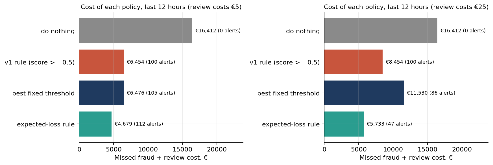

# Credit Card Fraud: From Classification to Decision

**284,807 card transactions, 492 frauds. Version 1 asked "is this fraud?" and reported precision 0.974 and recall 0.765. Version 2 asks what a fraud team actually needs: which alerts are worth an analyst's time, judged in euros, on transactions the model has never seen.**

**At a glance**

| | |
|---|---|
| **Question** | Which fraud alerts are worth an analyst's time, judged in euros? |
| **Data** | ULB credit-card dataset: 284,807 transactions, 492 frauds |
| **Result** | 0.76 average precision on a time-ordered split; an expected-loss rule cut cost 27% against the 0.5 cut-off and raised fraud value caught from 64% to 75% |
| **Stack** | Python, scikit-learn, pandas |
| **Project page** | [sanjanamaini.github.io/fraud](https://sanjanamaini.github.io/fraud/?utm_source=github&utm_medium=readme&utm_campaign=fraud) |

Data: the ULB Machine Learning Group's credit-card dataset (Dal Pozzolo et al. 2015; [Kaggle](https://www.kaggle.com/datasets/mlg-ulb/creditcardfraud)), two days of European card traffic in September 2013. `V1` to `V28` are principal components of undisclosed features; `Time` and `Amount` (euros) are raw.

**Notebook:** [`notebooks/fraud_decisions.ipynb`](notebooks/fraud_decisions.ipynb), step by step, every number printed by a cell.

## What v2 found

- **v1's numbers hold up, but are less certain than they look.** Its Random Forest, rerun with a fixed seed, gives precision 0.963 and recall 0.786. The test set held 98 frauds, so recall's 95% interval runs from 0.69 to 0.86. The dataset also has 1,081 exact duplicate rows, and 5 of v1's 98 test frauds had an identical twin in training.
- **On an honest test the Random Forest is still the best ranker.** The data is deduplicated, the models train on the first 24 hours, tune on hours 24 to 36, and are tested once on the last 12 hours (114 frauds, €16,412). Average precision is 0.760 (95% interval 0.68 to 0.83), tied with gradient-boosted trees and more than 600 times the no-skill level. ROC-AUC (0.96 to 0.97 for every model) hides the differences.
- **SMOTE helps a linear model rank (0.60 to 0.70) but makes its scores about 73 times too high.** Taken at face value they would flag 4,400 of 92,198 transactions at 0.5. Resampling is not calibration.
- **The decision rule matters more than the model.** Flag a transaction when its calibrated fraud probability times its amount exceeds the cost of a review. At €5 per review, that lowers the cost of the last 12 hours from €6,454 (v1's threshold of 0.5) to **€4,679, 27% less**, with a similar number of alerts. It catches 74.9% of fraud euros instead of 63.7%, by spending analyst time on large frauds instead of €2 ones. It holds for every review cost tested (€1 to €25).



| Review cost | v1 rule (score ≥ 0.5) | Expected-loss rule | Fraud euros caught (v1 / v2) |
|---|---|---|---|
| €1 | €6,054 | €3,416 | 63.7% / 82.4% |
| €5 | €6,454 | €4,679 | 63.7% / 74.9% |
| €10 | €6,954 | €4,823 | 63.7% / 74.8% |
| €25 | €8,454 | €5,733 | 63.7% / 72.2% |

Cost = missed fraud euros + review cost × alerts, on the last 12 hours. The review cost is an assumption, so a range is shown.

## The trade-off, stated plainly

The expected-loss rule catches fewer frauds by count (35% at €5, against v1's 68%) because it lets through frauds too small to be worth a review: 60 of the 63 frauds of €10 or less, worth €123 together. That includes €0 card tests, which matter as early warnings of bigger fraud. They need their own pattern-based rule; amount-based triage answers a different question.

## Reproduce

```bash
python -m venv .venv && .venv/bin/pip install -r requirements.txt
.venv/bin/python scripts/get_data.py     # downloads creditcard.csv (150 MB) and checks its SHA-256
cd notebooks && ../.venv/bin/jupyter nbconvert --to notebook --execute --inplace fraud_decisions.ipynb
```

The notebook is paired with `notebooks/fraud_decisions.py` (jupytext). Numbers are saved in `results/metrics.json`, tables in `results/*.csv`.

## Layout

```
notebooks/fraud_decisions.ipynb   v2, executed (source: fraud_decisions.py)
scripts/get_data.py               fetches the data (TensorFlow's public copy of the Kaggle file)
results/                          metrics, tables, figures
main.ipynb                        v1 (January 2024), unchanged
```

## Limits

Two days of data. The principal components were computed by the publisher on both days, a leak no user of this dataset can undo. Review costs are assumed. A caught fraud is assumed fully recovered. Card testing needs separate treatment.
